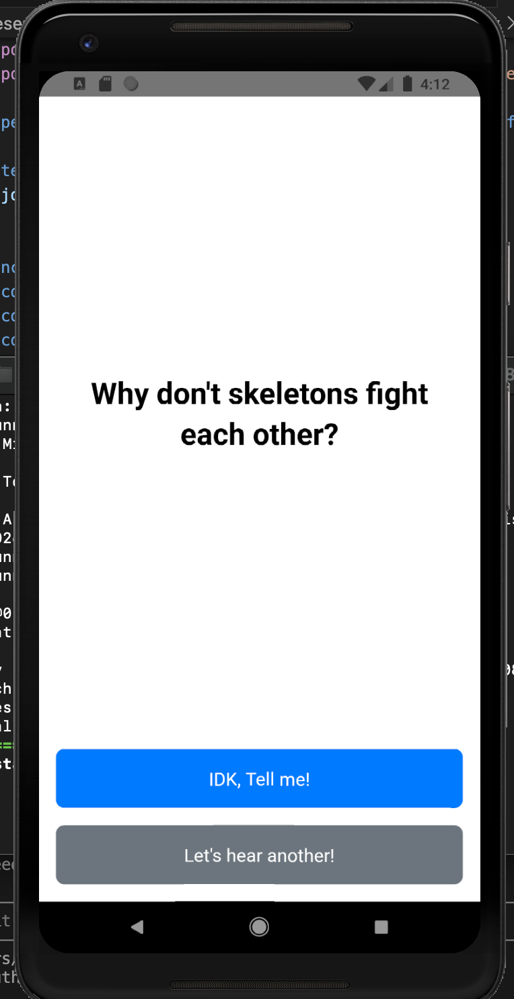
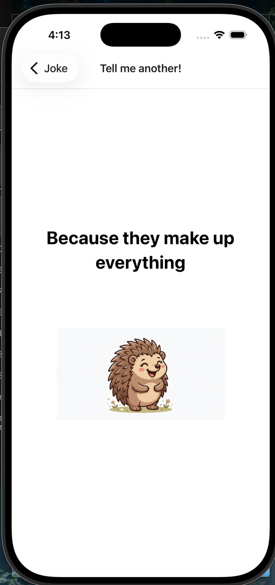
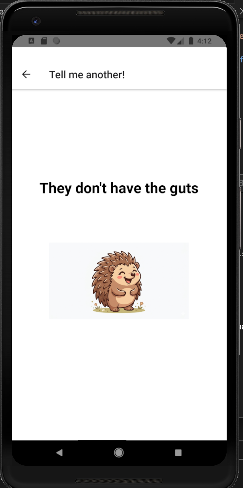

# JokeApp

A simple joke-telling app built as a learning project to gain hands-on exposure to React Native.

## About

This project was built for educational purposes — not production use. The goal was to get familiar with React Native fundamentals including navigation, hooks, component architecture, and testing.

**Tech stack:**
- React Native 0.85.3 / React 19 (TypeScript)
- React Navigation 7 (native stack)
- Jest + React Test Renderer

## What it does

The app presents a joke setup on one screen, then navigates to a second screen to reveal the punchline.

## Screenshots

| | iOS | Android |
|---|---|---|
| **Joke** |  |  |
| **Punchline** |  |  |

## Running locally

```bash
# Install dependencies
npm install

# iOS (requires Xcode + CocoaPods)
cd ios && pod install && cd ..
npm run ios

# Android (requires Android Studio + emulator)
npm run android

# Tests
npm test
```
